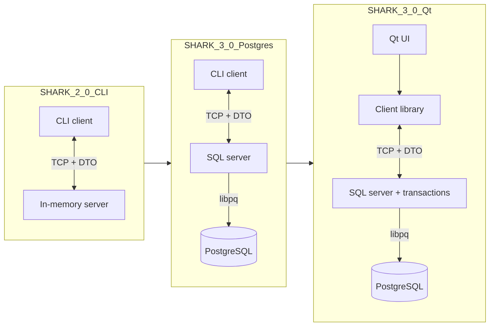
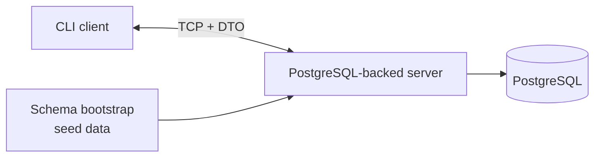

# ChatBot Shark


[](Shark_2_0_CLI/)
[](Shark_3_0_Postgres/)
[](Shark_3_0_Qt/)

> One chat system shown as three explicit implementations: first the in-memory CLI foundation, then the PostgreSQL-backed CLI server, then the Qt desktop client built on top of the same transport and domain ideas.

---

## [01] Three Implementations

| Implementation | Role in the repository | Storage | UI | Server discovery in the current code | Main illustration |
| --- | --- | --- | --- | --- | --- |
| [SHARK_2_0_CLI](Shark_2_0_CLI/) | Baseline version: shared `core`, smart pointers, DTO protocol, menu-driven client/server flow | In memory | CLI | `localhost -> LAN -> Internet/DDNS` only if `addressInternet` is configured | class diagram |
| [SHARK_3_0_Postgres](Shark_3_0_Postgres/) | Persistence step: PostgreSQL replaces the in-memory server while CLI remains | PostgreSQL | CLI | `localhost -> LAN -> Internet/DDNS` with a default remote endpoint still present in code | SQL architecture |
| [SHARK_3_0_Qt](Shark_3_0_Qt/) | Desktop step: Qt 6 UI, logs, connection monitor, richer flows on the same backend | PostgreSQL | Qt 6 | `localhost -> LAN` only in the current Qt transport layer | desktop UI workflow |

## [02] Architecture Evolution



---

## [03] SHARK_2_0_CLI


**What this implementation is for**

- Build the domain model once and reuse it on both client and server.
- Show smart pointers, associative containers and DTO serialization in a real chat model.
- Keep the entire system understandable without a database or GUI layer.

**What matters here**

- Shared `core` for `User`, `Chat`, `Message`, validation, exceptions and utilities.
- In-memory indices for fast lookup and ordered message traversal.
- Client-side server search on localhost, in LAN and optionally via Internet/DDNS if `addressInternet` is set.

**Illustration**

<p align="center">
  
</p>

Open the project: [Shark_2_0_CLI/README.md](Shark_2_0_CLI/README.md)

---

## [04] SHARK_3_0_Postgres


**What this implementation is for**

- Keep the CLI client flow recognizable while replacing the server storage model.
- Introduce schema bootstrap, seed data and direct SQL work through `libpq`.
- Show the repository's second engineering step without hiding the earlier one.

**What matters here**

- Server startup recreates and fills the demo schema.
- `connect_db.conf` becomes part of the run flow.
- Client discovery still includes localhost, LAN and Internet/DDNS in the current code.

**Illustration**



This implementation should be read primarily as the persistence step, not as "the same class diagram one more time".

Open the project: [Shark_3_0_Postgres/README.md](Shark_3_0_Postgres/README.md)

---

## [05] SHARK_3_0_Qt


**What this implementation is for**

- Replace terminal interaction with a Qt desktop client.
- Add operational UX: logs, connection-state monitoring, richer forms and lists.
- Keep the PostgreSQL-backed server and the DTO/TCP backbone visible.

**What matters here**

- The current Qt transport looks only on `localhost` and in the LAN.
- Logging, connection monitor and error routing are part of the actual product flow.
- This is the only implementation with a full screenshot set.

Open the project: [Shark_3_0_Qt/README.md](Shark_3_0_Qt/README.md)

---

## [06] Repository Layout

```text
.
├── LICENSE
├── README.md
├── Shark_2_0_CLI/
│   ├── .clang-format
│   ├── .vscode/
│   ├── Taskfile.yaml
│   ├── README.md
│   ├── Classes.png
│   ├── scripts/
│   └── src/
├── Shark_3_0_Postgres/
│   ├── .clang-format
│   ├── .vscode/
│   ├── Taskfile.yaml
│   ├── README.md
│   ├── Classes.png
│   ├── config/
│   ├── scripts/
│   └── src/
└── Shark_3_0_Qt/
    ├── .clang-format
    ├── .vscode/
    ├── Taskfile.yaml
    ├── README.md
    ├── config/
    ├── Screens/
    ├── Shark_UI/
    ├── scripts/
    └── src/
```

## [07] Requirements Snapshot

| Implementation | Compiler | CMake | External stack | Platforms |
| --- | --- | --- | --- | --- |
| SHARK_2_0_CLI | C++20 | 3.16+ | sockets only | macOS, Linux |
| SHARK_3_0_Postgres | C++20 | 3.16+ | PostgreSQL `libpq`, JSON, SQLite scaffold | macOS, Linux |
| SHARK_3_0_Qt | C++23 | 3.20+ | Qt 6, PostgreSQL `libpq` | macOS, Linux |

## [08] Tooling Snapshot

| Implementation | Local tooling |
| --- | --- |
| SHARK_2_0_CLI | project-local `.vscode`, `.clang-format`, `Taskfile`, root + local `src/client` / `src/server` CMake models |
| SHARK_3_0_Postgres | project-local `.vscode`, `.clang-format`, `Taskfile`, `config/` runtime folder, root + local `src/client` / `src/server` CMake models |
| SHARK_3_0_Qt | project-local `.vscode`, `.clang-format`, `Taskfile`, `config/` runtime folder, Qt UI launch flow |

## [09] License / Contact

Released under the MIT License - see [LICENSE](LICENSE).

Author: Yan Batytskiy - <YanBatytskiy@gmail.com>
