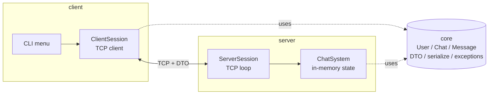
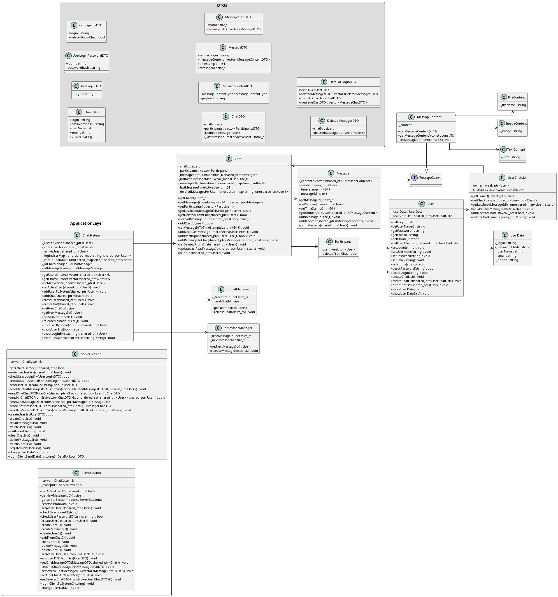

# SHARK_2_0_CLI


> The first complete ChatBot Shark implementation: a C++20 client/server chat with a shared domain core, in-memory state, TCP transport, DTO exchange, automatic server discovery, and a code structure that later grows into the PostgreSQL and Qt versions.

Back to the repository overview: [README.md](../README.md)

---

## [01] Why This Version Matters

This is not just a toy terminal chat. It is the architectural foundation for the whole repository:

- the client and the server already share the same domain model;
- the transport is already separated through DTOs and binary serialization;
- the chat storage model is already optimized beyond a flat vector;
- the code is already organized so the later PostgreSQL and Qt versions can reuse the same core instead of starting over.

For a reviewer or employer, this version is the cleanest place to understand the base engineering decisions before database and UI complexity are added.

## [02] Project Snapshot

| Aspect | Current implementation |
| --- | --- |
| Main goal | establish the core architecture before SQL persistence and desktop UI are introduced |
| Language | C++20 |
| Storage | in-memory containers only |
| UI | terminal menu |
| Transport | TCP + DTO structs serialized into a binary stream |
| Discovery | `localhost -> LAN -> Internet/DDNS` when `addressInternet` is configured |
| Platforms | macOS and Linux; client and server may run on different OSes |

## [03] What Was Built In This Iteration

The original intent of this version was broader than "CLI chat works". These are the key architectural steps that were implemented here:

1. **Smart-client direction.**
The client stores part of the state related to the active user. Client and server keep parallel structures, which is the first design step toward future offline work and later synchronization.

2. **Shared core for both sides.**
Common entities were moved into `core/`, so the same domain layer can be linked into both the client and the server instead of being duplicated.

3. **Timestamp model upgraded to milliseconds.**
Message timestamps are stored as `int64_t` millisecond values and formatted into readable strings when displayed.

4. **Message storage redesigned.**
`Chat` stores messages in `std::multimap<int64_t, std::shared_ptr<Message>>`, and also keeps `_messageIdToTimeStamp` for direct lookup by message id and timestamp.

5. **DTO transport layer introduced.**
Dedicated DTO structs and transport gateways were added so client and server exchange plain serialized data instead of raw domain objects.

6. **Input-validation logic reworked.**
Validation of login/password-style input was separated into explicit checks and exception flows instead of being spread across ad-hoc code.

7. **Less accidental `weak_ptr` complexity.**
Part of the lookup logic was moved to container-based indexing, reducing the need to traverse weak ownership chains for common operations.

8. **Top-level lookup maps added to `ChatSystem`.**
Examples:
`_loginUserMap` for user lookup by login and `_chatIdChatMap` for direct chat lookup by id.

9. **OS identification added at startup.**
The runtime identifies the platform and uses the socket abstraction accordingly.

10. **Minor responsibility redistribution between entities.**
Methods were moved between classes where needed so the model is easier to extend.

11. **Built-in test/demo procedures exist in the codebase.**
There are seeded/demo-oriented procedures for online testing of data; some of them are commented out in the product path, but they reflect the development approach used for this iteration.

12. **Automatic server discovery was designed as a real product concern.**
The client can search for the server on the local machine, in the LAN, and optionally through a remote Internet/DDNS address if configured.

## [04] Architecture At A Glance



The important thing here is reuse: the domain model is already isolated from the UI and from the transport details, which is exactly why later versions can add PostgreSQL and Qt without rewriting everything.

## [05] Project Layout

```text
SHARK_2_0_CLI/
├── .clang-format
├── .vscode/
│   ├── launch.json
│   ├── settings.json
│   └── tasks.json
├── CMakeLists.txt
├── README.md
├── Classes.png
├── scripts/
│   ├── build_macos.sh
│   ├── build_linux.sh
│   └── package_all.sh
└── src/
    ├── client/
    │   ├── CMakeLists.txt
    │   ├── client.cpp
    │   ├── client_session.cpp
    │   └── menu/
    ├── core/
    │   ├── chat/
    │   ├── chat_system/
    │   ├── exception/
    │   ├── message/
    │   ├── system/
    │   └── user/
    ├── dto/
    └── server/
        └── CMakeLists.txt
```

## [06] Code Tour

| Topic | Where to look |
| --- | --- |
| Shared domain model | [src/core/](src/core/) |
| `Chat` storage, timestamps, message indices | [src/core/chat/chat.h](src/core/chat/chat.h), [src/core/chat/chat.cpp](src/core/chat/chat.cpp) |
| Global user/chat lookup maps | [src/core/chat_system/chat_system.h](src/core/chat_system/chat_system.h), [src/core/chat_system/chat_system.cpp](src/core/chat_system/chat_system.cpp) |
| Custom exception hierarchy | [src/core/exception/](src/core/exception/) |
| DTO definitions | [src/dto/dto_struct.h](src/dto/dto_struct.h) |
| Binary serialization | [src/core/system/serialize.cpp](src/core/system/serialize.cpp) |
| Time helpers and OS/system helpers | [src/core/system/date_time_utils.cpp](src/core/system/date_time_utils.cpp), [src/core/system/system_function.cpp](src/core/system/system_function.cpp) |
| Client menu flow | [src/client/menu/](src/client/menu/) |
| Client-side discovery and connection setup | [src/client/client_session.cpp](src/client/client_session.cpp) |
| Server socket loop | [src/server/server_session.cpp](src/server/server_session.cpp) |
| Seed/demo initialization | [src/server/0_init_system.cpp](src/server/0_init_system.cpp) |

## [07] Discovery And Connection Logic

The current client code tries the server in this order:

1. `localhost`
2. local network discovery
3. Internet/DDNS, but only when `addressInternet` is not empty

Relevant files:

- [src/client/client_session.h](src/client/client_session.h)
- [src/client/client_session.cpp](src/client/client_session.cpp)

This README keeps that nuance explicit because in the current code the DDNS path is optional, not unconditional.

## [08] Feature Set

- User registration and sign-in.
- Private chat creation.
- Message sending with author and timestamp.
- Unread-message counting.
- Search for users by substring in login and display name.
- Shared-pointer-based resource ownership.
- Input validation and custom exceptions.
- Menu-driven terminal interaction.

## [09] Class Diagram

<p align="center">
  
</p>

## [10] Build And Run

### Scripted build on macOS

```bash
bash scripts/build_macos.sh
./build_macos/server &
./build_macos/client
```

### Scripted build on Linux

```bash
bash scripts/build_linux.sh
./build_linux_static/server &
./build_linux_static/client
```

### Optional Linux packaging

```bash
bash scripts/package_all.sh
```

That copies the binaries into `dist/linux/`.

### Local IDE models

This version also contains two local `CMake` entry points for focused work on the client and the server:

- [src/client/CMakeLists.txt](src/client/CMakeLists.txt)
- [src/server/CMakeLists.txt](src/server/CMakeLists.txt)

They make it possible to open and build only `src/client` or only `src/server` in an IDE while still reusing the same shared `core/` code.

### VS Code workflow

Editor tooling is kept local to `SHARK_2_0_CLI`:

- [`.vscode/settings.json`](.vscode/settings.json) points IntelliSense to `build_macos/compile_commands.json`
- [`.vscode/tasks.json`](.vscode/tasks.json) contains root and local `configure/build` tasks
- [`.vscode/launch.json`](.vscode/launch.json) contains launch profiles for the root build and for the local `src/client` / `src/server` builds

Open `SHARK_2_0_CLI/` itself as the workspace root, not the whole repository.

### Taskfile workflow

- [Taskfile.yaml](Taskfile.yaml) is the project entrypoint for build, format and run commands
- `task build:macos`, `task build:client`, `task build:server`
- `task format`, `task format:check`
- `task run:server`, `task run:client`

### Formatting

Formatting is manual and project-local:

- [`.clang-format`](.clang-format) defines the style
- VS Code tasks provide `format (src, clang-format)` and `format-check (src, clang-format)`
- include sorting is intentionally left disabled in this configuration

## [11] CLI Sample

```text
ChatBot 'Shark' Version 2.0 @2025

1. Register user
2. Sign in
0. Exit
```

## [12] Technical Notes For Reviewers

- This version intentionally keeps everything in memory so the structural decisions remain visible.
- It already contains the data model and transport boundaries that the later PostgreSQL and Qt implementations build on.
- It is the best entry point if the goal is to evaluate the author's C++ architecture decisions without the noise of database and UI frameworks.

## [13] Current Limits

- No persistence.
- No TLS.
- No GUI.
- No completed offline-sync feature yet.
- The Internet/DDNS branch is optional and depends on configured address data.

The next implementation is [SHARK_3_0_Postgres](../SHARK_3_0_Postgres/), where the same system moves to a PostgreSQL-backed server.

## [14] License

Released under the MIT License - see [LICENSE](../LICENSE).
