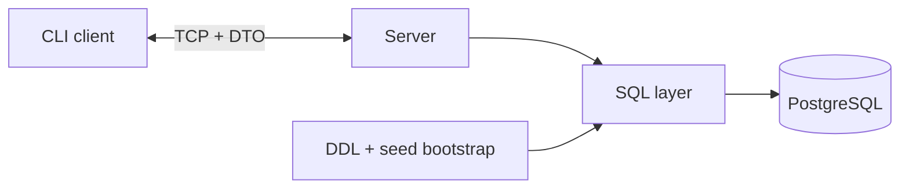

# SHARK_3_0_Postgres


> The second ChatBot Shark implementation keeps the CLI client shape but replaces the in-memory server with a PostgreSQL-backed one.

Back to the repository overview: [README.md](../README.md)

---

## [01] Snapshot

| Aspect | Current implementation |
| --- | --- |
| Purpose | preserve the CLI flow while introducing persistence and SQL-backed server logic |
| Storage | PostgreSQL via `libpq` |
| Config | `config/connect_db.conf` plus the local Docker template in `config/` |
| Discovery | `localhost -> LAN -> Internet/DDNS` with a default remote endpoint still present in code |
| Main visual | PostgreSQL-specific architecture |

## [02] What Changes Compared To 2.0

- Server state moves from memory to PostgreSQL.
- Startup recreates and seeds the demo schema.
- SQL-specific exceptions appear next to validation/login/network errors.
- The client keeps the familiar CLI and DTO-based wire flow.
- SQLite scaffolding appears on the client side for future work.

## [03] Database Structure

| Table | Purpose |
| --- | --- |
| `users` | user accounts and profile fields |
| `users_passhash` | password hashes |
| `chats` | chat identity |
| `participants` | user/chat relation |
| `messages` | persisted messages |
| `message_status` | delivery and read states |

Main files:

- [src/server/init_sql_requests.h](src/server/init_sql_requests.h)
- [src/server/0_init_system.cpp](src/server/0_init_system.cpp)
- [src/server/postgres_db.cpp](src/server/postgres_db.cpp)
- [src/server/sql_server.cpp](src/server/sql_server.cpp)

## [04] Code Map

| Topic | Entry point |
| --- | --- |
| PostgreSQL bootstrap | [src/server/0_init_system.cpp](src/server/0_init_system.cpp) |
| Ordered SQL requests | [src/server/init_sql_requests.h](src/server/init_sql_requests.h) |
| PG connection and query execution | [src/server/postgres_db.cpp](src/server/postgres_db.cpp) |
| Client transport and discovery | [src/client/client_session.cpp](src/client/client_session.cpp) |
| SQL exceptions | [src/core/exception/sql_exception.h](src/core/exception/sql_exception.h) |
| SQLite scaffold | [src/client/client_sql_lite.cpp](src/client/client_sql_lite.cpp) |

## [05] Discovery Logic

The current client code still tries the server in this order:

1. `localhost`
2. local network discovery
3. Internet/DDNS

That behavior lives in [src/client/client_session.cpp](src/client/client_session.cpp), and the default remote endpoint is declared in [src/client/client_session.h](src/client/client_session.h).

## [06] Architecture Focus



Using the same `Classes.png` as `SHARK_2_0_CLI` here was wrong. The important visual difference in this implementation is not the old shared class layout, but the introduction of the SQL server layer, schema bootstrap and PostgreSQL persistence.

## [07] Build And Run

Create the runtime config:

```bash
cp config/connect_db.local-docker.example config/connect_db.conf
```

The local template uses `"sslmode": "disable"` because the development Docker/desktop PostgreSQL setup does not expose TLS by default.

Optional local PostgreSQL backend:

```bash
task docker:up
task docker:delete   # full reset of the local PostgreSQL container and volume
```

### macOS

```bash
cp config/connect_db.local-docker.example config/connect_db.conf
bash scripts/build_macos.sh
./build_macos/server &
./build_macos/client
```

### Linux

```bash
cp config/connect_db.local-docker.example config/connect_db.conf
bash scripts/build_linux.sh
./build_linux_static/server &
./build_linux_static/client
```

Optional packaging:

```bash
bash scripts/package_all.sh
```

### Local IDE models

This version also contains two local `CMake` entry points for focused work on the client and the server:

- [src/client/CMakeLists.txt](src/client/CMakeLists.txt)
- [src/server/CMakeLists.txt](src/server/CMakeLists.txt)

They make it possible to open and build only `src/client` or only `src/server` in an IDE while still reusing the same shared `core/` and `dto/` layers.

### VS Code workflow

Editor tooling is kept local to `SHARK_3_0_Postgres`:

- [`.vscode/settings.json`](.vscode/settings.json) points IntelliSense to `build_macos/compile_commands.json`
- [`.vscode/tasks.json`](.vscode/tasks.json) contains root and local `configure/build` tasks
- [`.vscode/launch.json`](.vscode/launch.json) contains launch profiles for the root build and for the local `src/client` / `src/server` builds
- `bootstrap connect_db.conf` creates `config/connect_db.conf` from the local Docker template
- `validate connect_db.conf` checks that `config/connect_db.conf` exists and has the required database keys
- `docker db up` / `docker db down` manage the local PostgreSQL container through `config/docker-compose.yml`
- `docker db delete` removes the local PostgreSQL container, network, and volume data
- the server reads `connect_db.conf` from `config/`, not from `build_*`

Open `SHARK_3_0_Postgres/` itself as the workspace root, not the whole repository.

### Taskfile workflow

- [Taskfile.yaml](Taskfile.yaml) is the project entrypoint for build, format, run and Docker orchestration
- `task build:macos`, `task build:client`, `task build:server`
- `task format`, `task format:check`
- `task run:server`, `task run:client`
- `task config:bootstrap`
- `task docker:up`, `task docker:down`, `task docker:delete`, `task docker:logs`
- `config/.env.local-docker.example` defines the local Docker compose pattern
- `config/connect_db.local-docker.example` is the tracked DB config template

### Formatting

Formatting is manual and project-local:

- [`.clang-format`](.clang-format) defines the style
- VS Code tasks provide `format (src, clang-format)` and `format-check (src, clang-format)`
- include sorting is intentionally left disabled in this configuration

## [08] Limits

- Demo schema is recreated on startup.
- No TLS.
- No clustering.
- SQLite work is scaffolding, not a finished feature.

The next implementation is [SHARK_3_0_Qt](../Shark_3_0_Qt/).

## [09] License

Released under the MIT License - see [LICENSE](../LICENSE).
